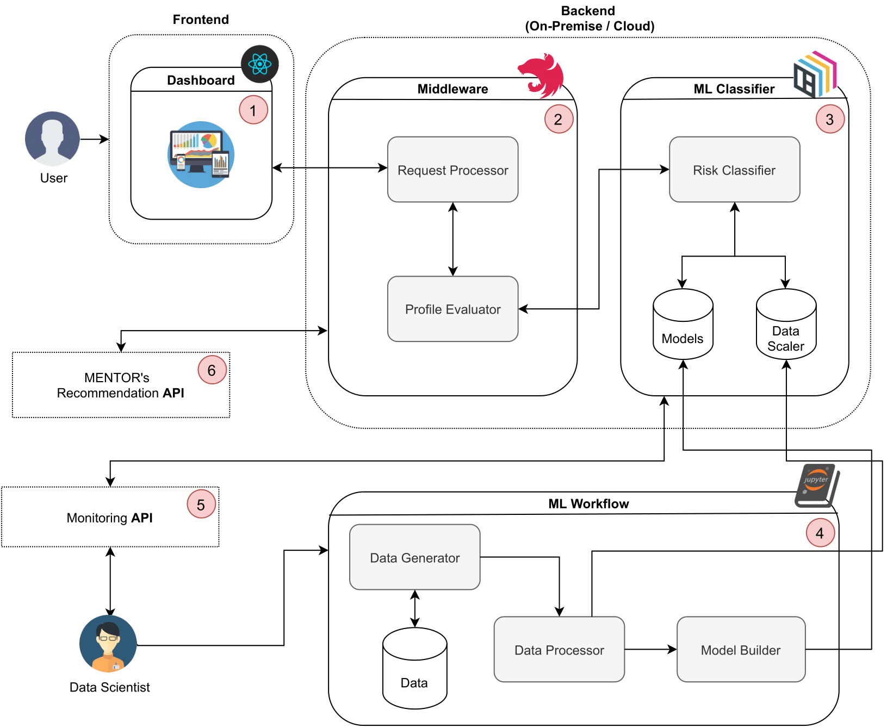

# Machine Learning-based Cybersecurity Risk Management Classification 

## Introduction and Motivation
As businesses strengthen their digital dependency, they also become more vulnerable to cyber threats. Therefore, besides the need for speed innovation, decision-makers in cybersecurity (e.g., network operator, company owner, or an expert team) have to be able to implement robust cybersecurity mechanisms while managing costs and risks associated with the business. Decision-making is usually defined as the activities involving phases of problem recognition, search for information, the definition of alternatives, and the selection of a list of ranked preferences [1]. During the cybersecurity planning, such activities involve (a) identify cybersecurity risks and associated costs, (b) determine impacts of cybersecurity in the business or service, (c) understand the business requirements and budget available for protection. Based on that, it is possible to estimate the overall impacts (e.g., financial loss occasioned by a business disruption) in order to decide whether and how much to invest in cybersecurity.Such an overall estimation can be done using different approaches. For instance, the Return Over Security Investments (ROSI) [2] offers a benchmark to determine when a specific investment in cybersecurity is recommended based on the potential financial loss given an assessed risk.

Thus, decision-makers have to decide how to handle a possible or imminent threat [3]. Between the different choices, the decision-maker can (a) determine a plan to prevent cyberattacks and its impacts proactively, (b) react against an imminent cyberattack, or (c) assume the risks, paying for the damage or delegating that to third-parties (e.g., cyber insurers). In general, if an attack happens, prevention is cheaper than react when an attack already surpassed the infrastructures. If the companies do not invest correctly in cybersecurity, the security of its operation depends on luck, and the impacts of attacks can be devastating, which is not acceptable by one that has a reputation to maintain. Thus, as of today, althought different approaches are placed for risk assessment, it is still not a trivial task because of a set of issues, such as information assimmetry and lack of expertise to run the assessment process. Therefore, intuitive and more automated approaches are still required.

## Architecture



## Installation using Docker

Clone the repository and navigate to project directory:

```bash
git clone https://github.com/Sulasdeli/SecRiskAI.git
cd SecRiskAI
```

Spin up the containers by running the following command: 

```bash
docker-compose up
```

The frontend should be running on localhost:3001

## References

[1]  M. Franco, E. Sula, B. Rodrigues, E. Scheid, B. Stiller: ProtectDDoS: A Platform for Trustworthy Offering and Recommendation of Protections; International Conference on Economics of Grids, Clouds, Software and Services (GECON 2020), Izola, Slovenia, September 2020, pp 1-12.
